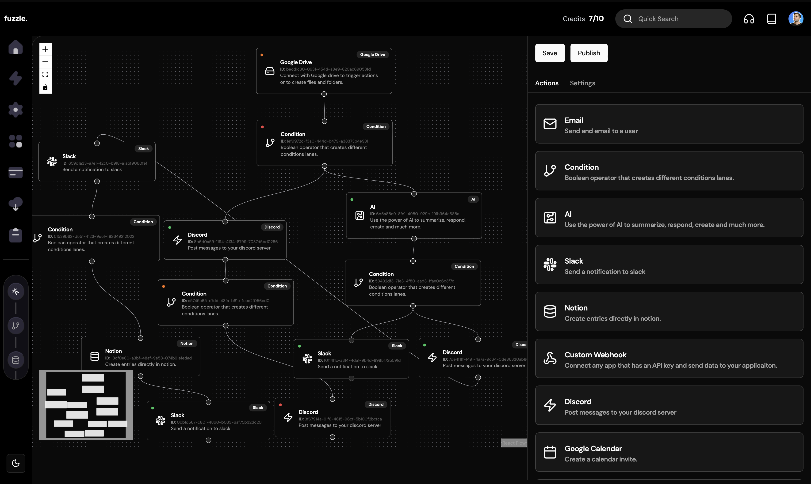

# Fuzzie - SAAS Automation Builder

<p align="center">
    
</p>

Fuzzie - A SAAS Automation Builder using Clerk Authentication, Neon Tech, Uploadcare, Ngrok, Nextjs 14, Stripe, Bun.

## Key Features

### 🤯 B2C SaaS
### 🏢 Connect users Google Drive to the app
### 🌐 Watch for changes in google drive
### 🚀 Connect users slack to send notification and custom messages
### 💻 Connect users discord to send notification and custom messages
### 🔄 Connect users Notion to create entries in a database
### 🛒 Stripe to charge month to month subscriptions 
### 🔐 Payments based on credits consumed
### 💳 Beautiful redesigned node interface
### 🚨 Drag and drop node builder
### 💰 Create automations flows
### 📊 Create a sequence of actions to fire after a trigger event happens
### 🗺️ Mini map to see all workflow nodes
### ⭐️ Infinite Canvas
### ✨ Expandable sidebar with drag feature
### ⚡️Aceternity UI
### ☀️ Light & Dark mode
### 📄 Functioning beautiful landing page

## Prerequisites

- Node version 18.17 or later

## Cloning the repository

```bash
git clone https://github.com/Comaecod/next-fuzzie-automation.git
```

## Installation

```bash
npm install
```

## Setup

Create a `.env` file in the root directory and add the following environment variables:

```env
NEXT_PUBLIC_CLERK_SIGN_IN_URL=/sign-in
NEXT_PUBLIC_CLERK_SIGN_UP_URL=/sign-up
NEXT_PUBLIC_CLERK_AFTER_SIGN_IN_URL=/dashboard
NEXT_PUBLIC_CLERK_AFTER_SIGN_UP_URL=/dashboard

NEXT_PUBLIC_CLERK_PUBLISHABLE_KEY=
CLERK_SECRET_KEY=

DATABASE_URL=

NEXT_PUBLIC_URL=https://localhost:3000
NEXT_PUBLIC_DOMAIN=localhost:3000
NEXT_PUBLIC_SCHEME=https://

NEXT_PUBLIC_GOOGLE_SCOPES=https://www.googleapis.com/auth/drive
NEXT_PUBLIC_OAUTH2_ENDPOINT=https://accounts.google.com/o/oauth2/v2/auth

NEXT_PUBLIC_UPLOAD_CARE_CSS_SRC=https://cdn.jsdelivr.net/npm/@uploadcare/blocks@
NEXT_PUBLIC_UPLOAD_CARE_SRC_PACKAGE=/web/lr-file-uploader-regular.min.css

DISCORD_CLIENT_ID=
DISCORD_CLIENT_SECRET=
DISCORD_TOKEN=
DISCORD_PUBLICK_KEY=
NEXT_PUBLIC_DISCORD_REDIRECT=https://discord.com/oauth2/authorize?client_id=*CLIENTID*&response_type=code&redirect_uri=https%3A%2F%2Flocalhost%3A3000%2Fapi%2Fauth%2Fcallback%2Fdiscord&scope=identify+guilds+connections+guilds.members.read+email+webhook.incoming

NOTION_API_SECRET=
NOTION_CLIENT_ID=
NOTION_REDIRECT_URI=https://localhost:3000/api/auth/callback/notion
NEXT_PUBLIC_NOTION_AUTH_URL=https://api.notion.com/v1/oauth/authorize?client_id=*CLIENTID*&response_type=code&owner=user&redirect_uri=https%3A%2F%2Flocalhost%3A3000%2Fapi%2Fauth%2Fcallback%2Fnotion

# ,groups:read,mpim:read,im:read'

SLACK_SIGNING_SECRET=
SLACK_BOT_TOKEN=
SLACK_APP_TOKEN=
SLACK_CLIENT_ID=
SLACK_CLIENT_SECRET=
SLACK_REDIRECT_URI=https://localhost:3000/api/auth/callback/slack
NEXT_PUBLIC_SLACK_REDIRECT=https://slack.com/oauth/v2/authorize?client_id=*CLIENTID*&scope=chat:write,channels:read,groups:read,mpim:read,im:read&user_scope=chat:write,channels:read,groups:read,mpim:read,im:read&redirect_uri=https%3A%2F%2Flocalhost%3A3000%2Fapi%2Fauth%2Fcallback%2Fslack

GOOGLE_CLIENT_ID=
GOOGLE_CLIENT_SECRET=
OAUTH2_REDIRECT_URI=https://electric-grizzly-7.clerk.accounts.dev/v1/oauth_callback
NGROK_URI=
CRON_JOB_KEY=
STRIPE_SECRET=
```

## Setup Prisma

Ensure you have added a Database (recommended using NeonDB). Then run:

```bash
npx prisma generate
npx prisma db push
```

## Starting the app

```bash
npm run dev
```
